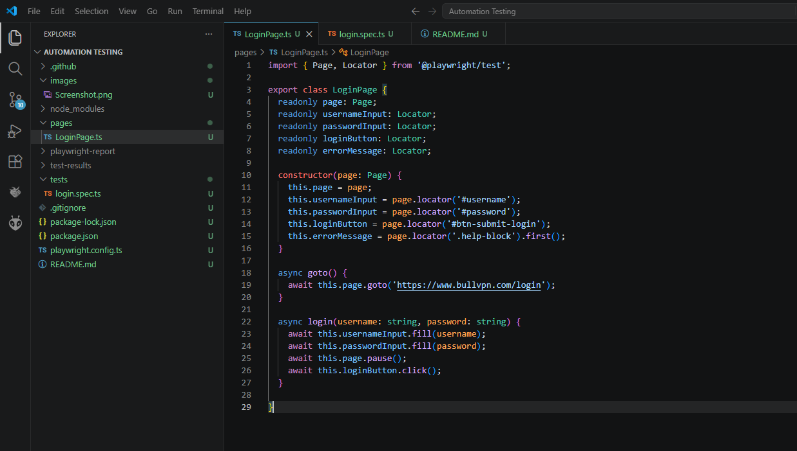
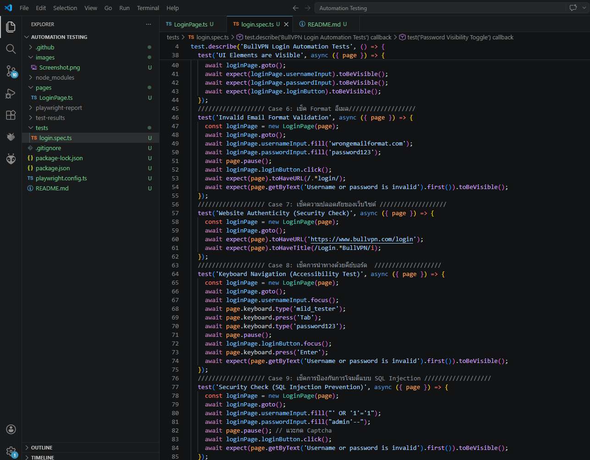
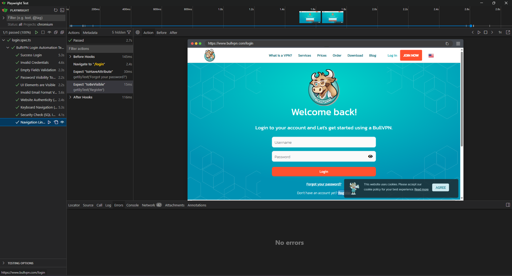

🚀 BullVPN Login Automation Test (Playwright)
Automated testing project for the BullVPN login page (https://www.bullvpn.com/login). This project is built using Playwright with TypeScript and strictly follows the Page Object Model (POM) design pattern for better maintainability and readability.

📌 Test Cases Covered (10 Comprehensive Scenarios)
This suite includes a mix of Functional, UI/UX, Security, and Accessibility testing:

Core Functionality:

[Success] Success Login: Validates successful login and redirection to the Account page.

[Failed] Invalid Credentials: Validates that the system shows an error message for incorrect passwords.

Form Validation & UX:
3. [Validation] Empty Fields: Ensures the system blocks login attempts with empty fields.
4. [Validation] Invalid Email Format: Verifies that the system handles missing '@' symbols gracefully.
5. [UX] Password Visibility Toggle: Verifies that the eye icon changes the input type from 'password' to 'text'.
6. [UI] Elements Visibility: Confirms that all essential UI components are correctly loaded.
7. [Routing] Navigation Links: Checks if the "Forgot Password" and "Register" links have the correct destinations.

Advanced & Security Testing:
8. [Security] Website Authenticity: Validates the domain (HTTPS) to ensure protection against Phishing pages.
9. [Security] SQL Injection Prevention: Tests basic SQL injection inputs to ensure the system does not crash.
10. [Accessibility] Keyboard Navigation: Ensures the login flow can be fully completed using only the Tab and Enter keys.

## 🎥 Demo

🛠️ Tech Stack & Architecture
Framework: Playwright

Language: TypeScript

Design Pattern: Page Object Model (POM)

⚙️ Prerequisites
Node.js (v16 or higher)

📦 Installation & Setup
Clone this repository:

Bash
git clone https://github.com/Smild77
Navigate to the project directory:

Bash
cd Automation Testing
Install dependencies:

Bash
npm install
Install Playwright browsers:

Bash
npx playwright install
▶️ How to Run the Tests
To run the tests in UI mode (Recommended to view execution):

Bash
npx playwright test --ui
⚠️ Important Note Regarding reCAPTCHA (Production Environment)
Since this test executes against the live Production environment, the reCAPTCHA system will intercept automated interactions.
To demonstrate the full capability of the test suite, await page.pause(); commands are implemented in flows requiring login. This allows the QA to manually bypass the reCAPTCHA challenge before resuming the script.
(In a real-world CI/CD pipeline, this would run in a Staging environment with reCAPTCHA disabled or bypassed via Test Keys).